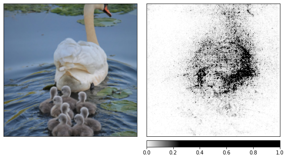
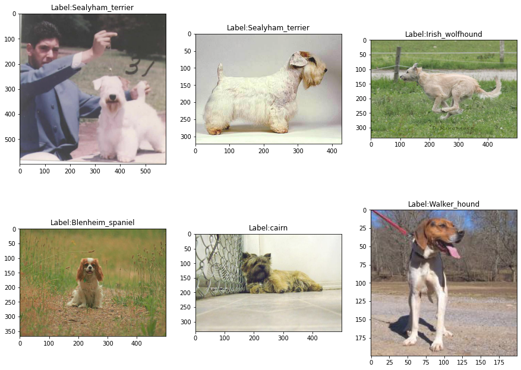
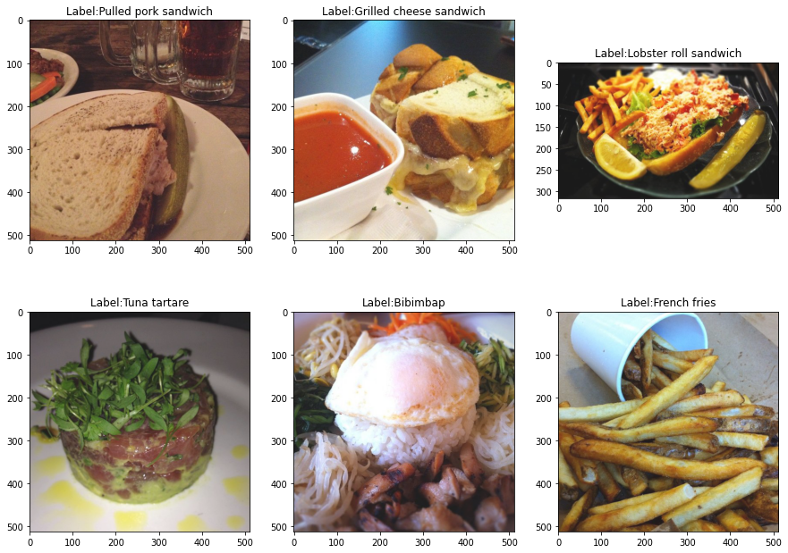
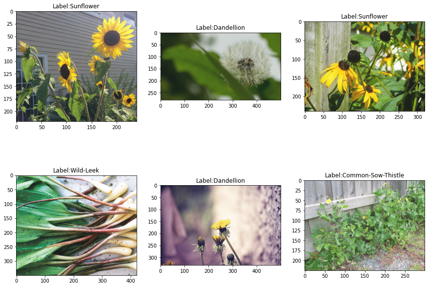
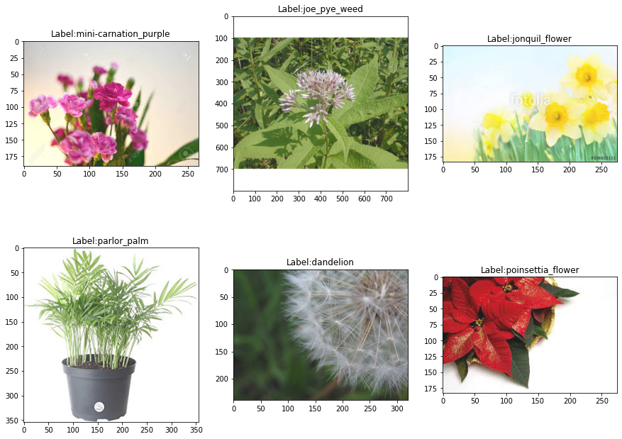
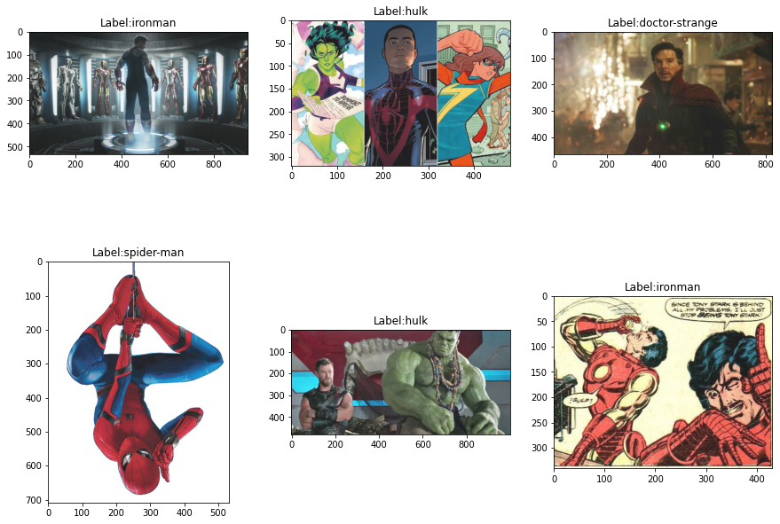

# XAI

### Installation

Install Pytorch using [Local Installation Guide](https://pytorch.org/get-started/locally/). Then run:

```shell
pip install  -r requirements.txt
jupyter notebook
```

If you want to work on the same datasets download them using references in [Datasets Section](#datasets).

## Training models

```shell
python train_model.py --model_version=resnet18 --dataset=edible-plants
```

##### Parameters:
- `model_version`: version of the model [`resnet18`, `resnet50`]
- `dataset`: version of the dataset [`edible-plants`, `food101`, `marvel`, `plant-data`, `stanford-dogs`]

### Saved Model output:
`models/saved_models/{model_version}-{dataset}.pth`

## Test models

```shell
python test_model.py --model_version=resnet18 --dataset=edible-plants
```

##### Parameters:
- `model_version`: version of the model [`resnet18`, `resnet50`]
- `dataset`: version of the dataset [`edible-plants`, `food101`, `marvel`, `plant-data`, `stanford-dogs`]
- `weights`: (optional) path to `.pth` file with saved model, if none pasted then default one is used (`models/saved_models/{model_version}-{dataset}.pth`)


## List of Notebooks

- `Resnet18 IG NoiseTunnel.ipynb` - Integrated Gradients base explanation
- `Resnet18 Deconvolution.ipynb` - Deconvolution base explanation
- `Resnet18 GBP.ipynb` - Guided Backpropagation base explanation
- `Resnet18 Saliency.ipynb` - Saliency base explanation
- `dataset_eda/Stanford Dogs.ipynb` - EDA Stanford Dogs dataset
- `dataset_eda/Food 101.ipynb` - EDA Food 101 dataset
- `dataset_eda/Edible wild plants.ipynb` - EDA Edible wild plants dataset

## Example:



IG with Noise Tunnel

## References

* `IntegratedGradients`: [Axiomatic Attribution for Deep Networks, Mukund Sundararajan et al. 2017](https://arxiv.org/abs/1703.01365)
* `NoiseTunnel`: [Sanity Checks for Saliency Maps, Julius Adebayo et al. 2018](https://arxiv.org/abs/1810.03292)
* `Saliency`: [Deep Inside Convolutional Networks: Visualising
Image Classification Models and Saliency Maps, K. Simonyan, et. al. 2014](https://arxiv.org/pdf/1312.6034.pdf)
* `Deconvolution`: [Visualizing and Understanding Convolutional Networks, Matthew D Zeiler et al. 2014](https://arxiv.org/pdf/1311.2901.pdf)
* `Guided Backpropagation`: [Striving for Simplicity: The All Convolutional Net, Jost Tobias Springenberg et al. 2015](https://arxiv.org/pdf/1412.6806.pdf)
* `Infidelity and Sensitivity`: [On the (In)fidelity and Sensitivity for Explanations](https://arxiv.org/abs/1901.09392)
* `ROAR`: [A Benchmark for Interpretability Methods in Deep Neural Networks](https://arxiv.org/abs/1806.10758)
* `SAM`: [SAM: The Sensitivity of Attribution Methods to Hyperparameters](https://arxiv.org/abs/2003.08754)

## Datasets

Extract all datasets into `./data` directory.

* `Stanford Dogs Dataset` - [Stanford Dogs Dataset](https://www.kaggle.com/jessicali9530/stanford-dogs-dataset)

* `Food 101` - [Food 101 - Foodspotting](https://www.kaggle.com/kmader/food41)

* `Edible wild plants` - [Edible wild plants](https://www.kaggle.com/gverzea/edible-wild-plants)

* `Plants_Dataset` - [Plants_Dataset[99 classes]](https://www.kaggle.com/muhammadjawad1998/plants-dataset99-classes?select=Plant_Data)

* `Marvel Heroes` - [Marvel Heroes](https://www.kaggle.com/hchen13/marvel-heroes)
